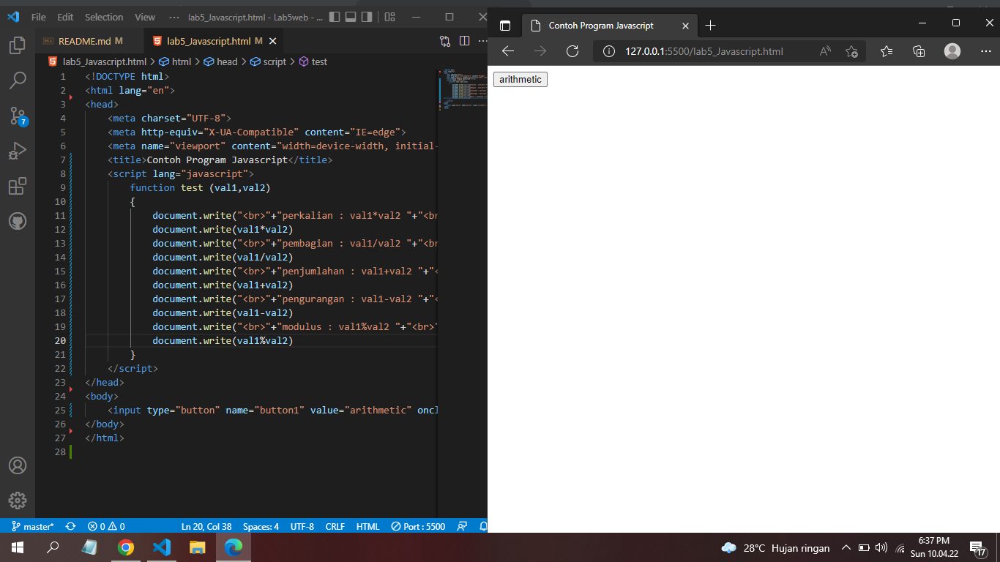

# Tugas Lab5web
## Profil

| #               | Biodata             |
| --------------- | ------------------- |
| **Nama**        | Rangga Saputra |
| **NIM**         | 312010266           |
| **Kelas**       | TI.20.A.2           |
| **Mata Kuliah** | Pemrograman Web     |

## Langkah1 `persiapan`
1. buat file baru bernama `lab5_javascript.html`
2. tambahkan kode berikut
```html
<!DOCTYPE html>
<html lang="en">

<head>
    <meta charset="UTF-8">
    <meta http-equiv="X-UA-Compatible" content="IE=edge">
    <meta name="viewport" content="width=device-width, initial-scale=1.0">
    <title>Pengenalan JavaScript</title>
</head>

<body>
    <h1>Pengenalan JavaScript</h1>
    <h3>Contoh document.write dan console.log</h3>
    <script>
        document.write("Hello World");
        console.log("Hello World");
    </script>
</body>
</html>
```
* Maka hasilnya akan seperti ini


## Langkah 2 `Alert`
1. Tambahkan kode berikut ke dalam tag `<script>`.

```javascript
window.alert("Ini merupakan pesan untuk anda");
```
* Maka hasilnya akan seperti ini


## Langkah 3 `Method dalam objek`
1. Tambahkan kode berikut ke dalam tag `<script>`.
2. Tambahkan kode berikut ke dalam tag `<script>`.

```javascript
document.write("Selamat mencoba javascript <br>");
document.write("Semoga Sukses");
```
* Maka hasilnya akan seperti ini


## Langkah 4 `Prompt`
1. Tambahkan kode berikut ke dalam tag `<script>`.

```javascript
var nama = prompt("Siapa nama anda?");
document.write("Hai " + nama);
```

2. Saat dijalankan akan meminta suatu inputan yang nanti akan dimasukan kedalam variable `nama`.
* contohnya seperti ini


## Langkah 5 `Function`
1. Buat function `pesan()`.

```javascript
function pesan() {
    alert("Memanggil javascript lewat body onload");
}
```

2. Tambahkan atribut pada tag `<body>`.

```html
<body onload="pesan()">
```

3. Maka ketika web load akan seperti berikut.


## Langkah 6 Operasi Aritmatika
1. Buat function `aritmatika()` pada tag `<script>`.
```javascript
function test (val1,val2)
        {
            document.write("<br>"+"perkalian : val1*val2 "+"<br>")
            document.write(val1*val2)
            document.write("<br>"+"pembagian : val1/val2 "+"<br>")
            document.write(val1/val2)
            document.write("<br>"+"penjumlahan : val1+val2 "+"<br>")
            document.write(val1+val2)
            document.write("<br>"+"pengurangan : val1-val2 "+"<br>")
            document.write(val1-val2)
            document.write("<br>"+"modulus : val1%val2 "+"<br>")
            document.write(val1%val2)
        }
```
2. buatlah input di dalam tag `body`
```javascript
 <input type="button" name="button1" value="arithmetic" onclick=test(9,4)>
```
* sebelum di klik


* Sesudah di klik


## Langkah 7 SELEKSI KONDISI `(IF/ELSE)`
### codinganya seperti ini.
```html
<!DOCTYPE html>
<html lang="en">
<head>
    <meta charset="UTF-8">
    <meta http-equiv="X-UA-Compatible" content="IE=edge">
    <meta name="viewport" content="width=device-width, initial-scale=1.0">
    <title>Contoh if-else</title>
</head>
<body>
    <script language = "javascript">
    <!--
    var nilai = prompt("nilai (0-100): ", 0);
    var hasil = "";
    if (nilai >= 60)
    hasil = "lulus";
    else 
    hasil = "tidak lulus";
    document.write("hasil: "+ hasil);
    //-->
    </script>
</body>
</html>
```


## Langkah 8 Penggunaan operator switch untuk seleksi kondisi
### codinganya seperti ini.
```html
<!DOCTYPE html>
<html lang="en">
<head>
    <meta charset="UTF-8">
    <meta http-equiv="X-UA-Compatible" content="IE=edge">
    <meta name="viewport" content="width=device-width, initial-scale=1.0">
    <title>Contoh program javascript</title>

    <script language = "javascript">
    function test ()
    {
        val1=window.prompt("input nilai (1-5):")
        switch (val1)
        {
            case "1" :
                document.write("bilangan satu")
                break
            case "2" :
                document.write("bilangan dua")
                break
            case "3" :
                document.write("bilangan tiga")
                break
            case "4" :
                document.write("bilangan empat")
                break
            case "5" :
                document.write("bilangan lima")
                break
            default :
                document.write("bilangan lainnya")
        }
    }
    </script>
</head>
<body>
    <input type="button" name="button1" value="switch" onclick=test()>
</body>
</html>
```
* Maka hasilnya akan seperti ini


## Langkah 9 Pembuatan Form
1. Form input
### codinganya seperti ini.
```html
<!DOCTYPE html>
<html lang="en">
<head>
    <meta charset="UTF-8">
    <meta http-equiv="X-UA-Compatible" content="IE=edge">
    <meta name="viewport" content="width=device-width, initial-scale=1.0">
    <title>Contoh program javascript</title>

    <script language = "javascript">
    function test ()
    {
        var val1=document.kirim.T1.value
        if (val1%2==0)
            document.kirim.T2.value="bilangan genap"
        else
            document.kirim.T2.value="bilangan ganjil"
    }
    </script>
</head>
<body>
    <form method="POST" name="kirim">
        <p>BIL <input type="text" name="T1" size="20">
        MERUPAKAN BIL <input type="text" name="T2" size="20"></p>
        <p><input type="button" value="TEBAK" name="B1" onclick=test()></p>
    </form>
</body>
</html>
```
* Maka hasilnya akan seperti ini.


2. Form button
### codinganya seperti ini
```html
<!DOCTYPE html>
<html lang="en">
<head>
    <meta charset="UTF-8">
    <meta http-equiv="X-UA-Compatible" content="IE=edge">
    <meta name="viewport" content="width=device-width, initial-scale=1.0">
    <title>Objek document</title>
</head>
<body>
    <script language = "javascript">
    <!--
    function ubahWarnaLB(warna) {
        document.bgColor = warna;
    }
    function ubahWarnaLD(warna) {
        document.fgColor = warna;
    }
    //-->
    </script>

    <h1>tes</h1>
    <form>
        <input type="button" value="Latar Belakang Hijau" onclick="ubahWarnaLB('GREEN')">
        <input type="button" value="Latar Belakang Putih" onclick="ubahWarnaLB('WHITE')">
        <input type="button" value="Teks Kuning" onclick="ubahWarnaLD('YELLOW')">
        <input type="button" value="Teks Biru" onclick="ubahWarnaLD('BLUE')">
    </form>
    <script language = "javascript">
    <!--
    document.write("Dimodifkasi terakhir pada" + document.lastModified);
    //-->
    </script>
</body>
</html>
```
* Maka hasilnya akan seperti ini


## Langkah 10 HTML DOM
1. Pilihan menggunakan checkbox dengan perhitungan otomatis
### codinganya seperti ini.
```html
<!DOCTYPE html>
<!-- file daftar menu.html -->
<html lang="en">
<head>
    <meta charset="UTF-8">
    <meta http-equiv="X-UA-Compatible" content="IE=edge">
    <meta name="viewport" content="width=device-width, initial-scale=1.0">
    <title>Daftar Menu</title>
    <script lang="javascript">
        function hitung(ele) {
            var total = document.getElementById('total').value;
                total = (total ? parseInt(total) : 0);
            var harga = 0;

            if (ele.checked) {
                harga = ele.value;
                total += parseInt(harga);
            } else {
                harga = ele.value;
                if (total > 0)
                    total -= parseInt(harga);
            }
            document.getElementById('total').value = total;
        }
    </script>
</head>
<body>
    <h1>Daftar Menu Makanan</h1>
    <label><input type="checkbox" value="5000" name="menu1" id="menu1" onclick="hitung(this);">Ayam Goreng Rp. 5.000</label><br>
    <label><input type="checkbox" value="500" name="menu2" id="menu2" onclick="hitung(this);">Tempe Goreng Rp. 500</label><br>
    <label><input type="checkbox" value="2500" name="menu3" id="menu3" onclick="hitung(this);">Telur Dadar Rp. 2.500</label><hr>
    <strong>Total Bayar: Rp. <input type="text" name="total" id="total"></strong>
</body>
</html>
```
* Maka hasilnya akan seperti ini.


## Pertanyaan Dan Tugas
1. Buat script untuk melakukan validasi pada isian form.
### HTML
```html
<!DOCTYPE html>
<!--File: daftar_menu.html//-->
<html lang="en">
<head>
    <meta charset="UTF-8">
    <meta http-equiv="X-UA-Compatible" content="IE=edge">
    <meta name="viewport" content="width=device-width, initial-scale=1.0">
    <title>Form</title>
    <link rel="stylesheet" href="style.css">
    <script type="text/javascript">
        function validasiform() {
            var nama = document.getElementById("nama").value;
            var email = document.getElementById("email").value;
            var alamat = document.getElementById("alamat").value;
            if (nama != "" && email != "" && alamat != ""){
                alert('Anda Berhasil Mengisi Data Dengan Lengkap')
                return true;
            } else {
                alert('Isi Data Dengan Lengkap !');
                return false;
            }
        }
    </script>
</head>
<body>
    <div id="container">
    <h2>Data Diri</h2>
        <form action="#" method="POST" onSubmit="return validasiform()">
            <div class="data">
                <div>
                    <label for="name">Nama :</label>
                    <input type="text" name="name" id="nama">
                </div>
                <div>
                    <label for="email">Email :</label>
                    <input type="email" name="email" id="email">
                </div>
                <div>
                    <label for="alamat">Alamat :</label>
                    <textarea name="alamat" id="alamat" cols="30" rows="5"></textarea>
                </div>
                <button id="button" type="submit">Submit</button>
            </div>
        </form>
    </div>
</body>
</html>
```
### CSS
```css
*{
    font-family: Verdana, Geneva, Tahoma, sans-serif;
}

body {
    background-color: rgb(0, 57, 143);
}

#container {
    padding: 20px;
    width: 30%;
    margin: 80px auto;
    border-radius: 4px;
    color: white;
}

h2 {
    padding-top: 20px;
    text-align: center;
}

#nama, #email, #alamat {
    margin: 10px auto ;
    width: 95%;
}

.data {
    font-size: 10pt;
    padding: 10px 0;
    display: block;
    margin: 10px;
    box-sizing: border-box;   
}

#button {
    border: 0 solid black;
    border-radius: 2px;
    margin: 10px auto;
    width: 97%;
    padding: 10px;
    color: white;
    background-color: rgb(0, 101, 253);
}

#button:hover{
    background-color: rgb(0, 47, 117);
    cursor: pointer;
    transition: 0.5s;
}
```
* Jika mengisi kurang lengkap akan seperti ini.


* Jika mengisi kurang lengkap.

